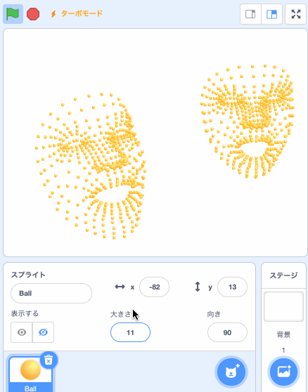
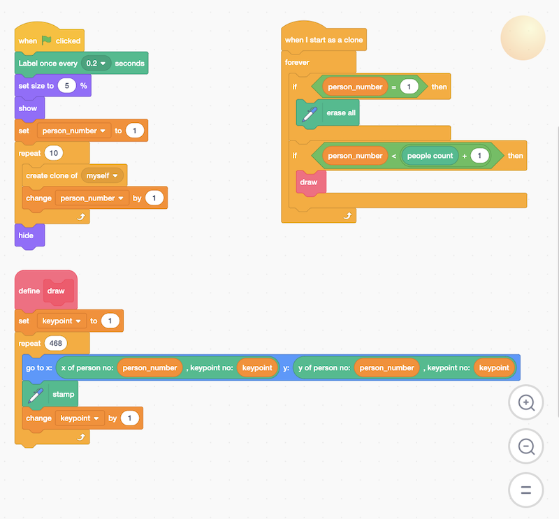

# Facemesh2Scratch

Face tracking on Scratch 3 with Webcam only.

It uses facemesh package provided by MediaPipe and TensorFlow.js. If you want to know about the technology behind, please refer to "[Face and hand tracking in the browser with MediaPipe and TensorFlow.js](https://blog.tensorflow.org/2020/03/face-and-hand-tracking-in-browser-with-mediapipe-and-tensorflowjs.html)"

*Read this in other languages: [English](README.en.md), [日本語](README.md).*

## Demo Movie

### Single face

  

### Multiple faces

  

## How to use

- Open https://stretch3.github.io/ (other custom extensions are available) or https://champierre.github.io/facemesh2scratch/ on Chrome.
- Open Facemesh2Scratch extension.

## Sample project

https://github.com/champierre/facemesh2scratch/raw/master/sample_projects/facemesh.sb3



## Licence

- Facemesh2Scratch is under [BSD 3-Clause License](./LICENSE.md), open source and freely available to anyone. You can use it at your classes, workshops. Commercial usage is also accepted. If you or your students created something cool using Facemesh2Scratch, please share it on SNS using hashtag #facemesh2scratch or let me know to any of these contacts. Interesting projects will be added to the "Examples of use".

## Examples of use

- [Control an object by face direction](https://twitter.com/y0sh1k10/status/1244241128074797057)
- [Blow a balloon](https://twitter.com/kuroyanagi_css/status/1241510719834558467)

## Requirements

- OS
  - Windows 8 (TBD)
  - Windows 10 (TBD)
  - MacOS
  - iOS
- Browser
  - Chrome
  - Safari(iOS)

Facemesh2Scratch sometimes does not work because of some Chrome extensions. Please switch to [Guest Mode](https://support.google.com/chrome/answer/6130773) in such cases.

## FAQ

- Q. acemesh2Scratch extension doesn't work properly.

- A. Open the Developer Tools on Chrome and check the Console tab. If you see the error "Error: WebGL is not supported on this device", try to enable Hardware Acceleration by turning on "Use hardware acceleration when available available" in Settings and restarting Chrome.

Ref. [How to Turn Hardware Acceleration On and Off in Chrome](https://www.howtogeek.com/412738/how-to-turn-hardware-acceleration-on-and-off-in-chrome/)

## For Developers - How to run Facemesh2Scratch extension on your computer

1. Setup LLK/scratch-gui on your computer.

  ```
  % git clone git@github.com:LLK/scratch-gui.git
  % cd scratch-gui
  % npm install
  ```

2. In scratch-gui folder, clone Facemesh2Scratch. You will have facemesh2scratch folder under scratch-gui.

  ```
  % git clone git@github.com:champierre/facemesh2scratch.git
  ```

3. Run the install script.

  ```
  % sh facemesh2scratch/install.sh
  ```

4. Run Scratch, then go to http://localhost:8601/.

  ```
  % npm start
  ```
